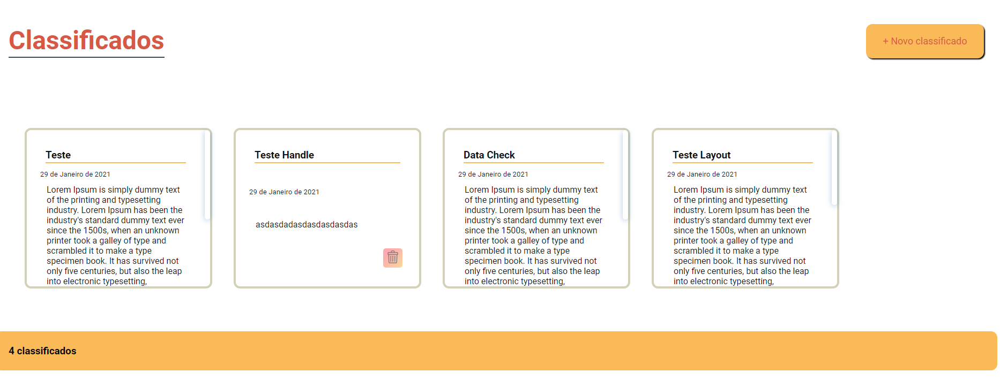
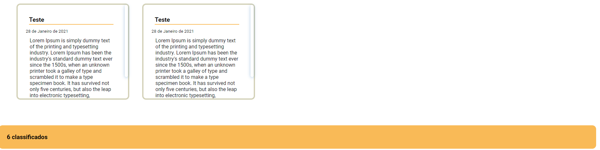
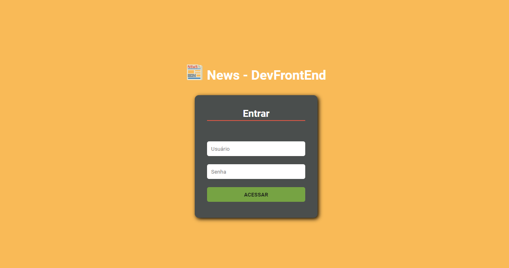
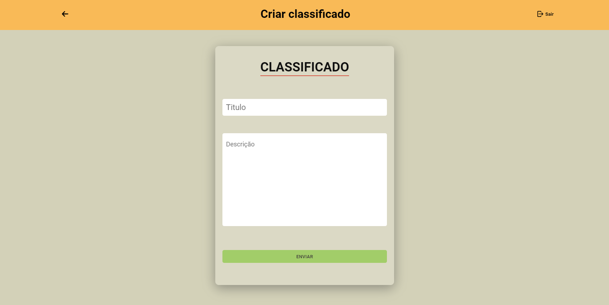
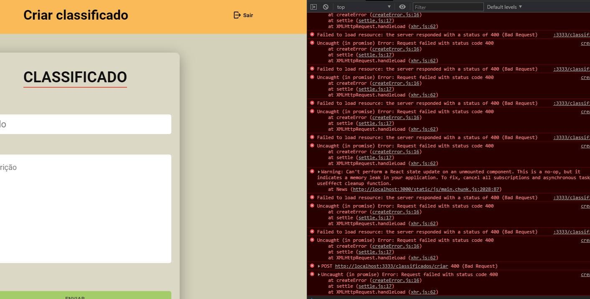
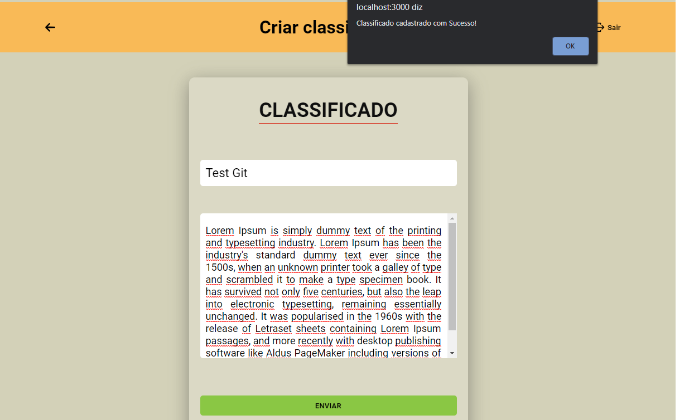
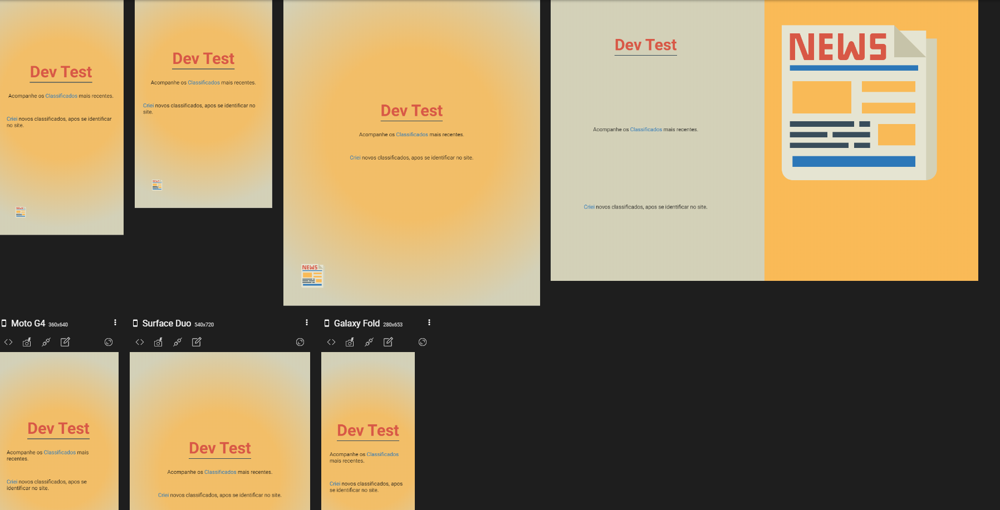
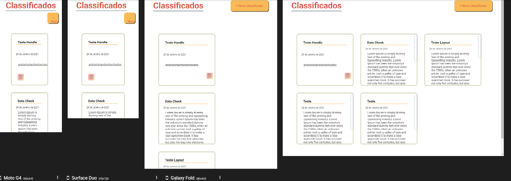
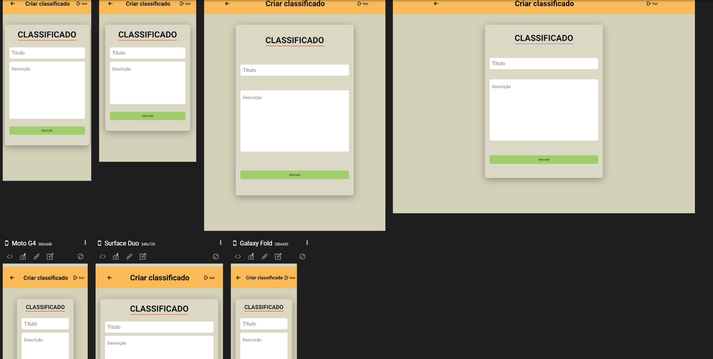
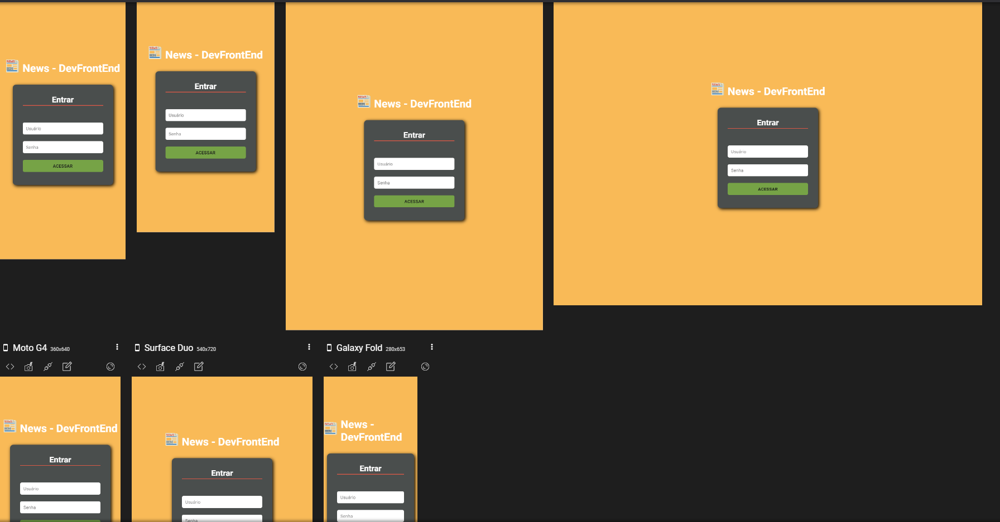

pt-br,

## Instruções

`yarn install` 
Instalar as dependências.
 <small>OU</small>
`npm install`  
`yarn start` 
Executar o back-end

Executado em http://localhost:3000/

### Nota

Todas as rotas estão liberadas para qualquer pessoa, EXCETO, rota de criação. Para ela existe um usuário:"user", password: "1234"

Caso não queira usar algum Frontend, o insominia pode ser usado para utilizar os metodos,(post,delete,get)

Caso queira ver as tabelas dentro do banco de dados eu recomento usar o BeeKeeper Studio

O backend dessa applicação esta em <a href="https://github.com/RpThiagoluiz/desafio-challenger-backend" target="_blank"
rel="noopener noreferrer">aqui</a>

Optei por não utilizar TypeScrip, no frontend, pois tenho pouca experiencia aqui, futuramente quero adicionar.

Usei styled-components, não quis utilizar uma biblioteca pronta pois achei mais desafiador criar meu proprio CSS

Usei uma tela de login para autentificar, por enquanto somente no front-end futuramente tambem quero adc uma autenticação JWT, somente quando for criar um classificado para que seja restringindo o acesso.

en-us,

## Instructions

`yarn install` 
 Install as dependencies. 
 <small> OR </small>
`npm install`  
`yarn start` 
 Run the backend 

 Executed at http: // localhost: 3000 / 

### Note

 All routes are free for anyone, EXCEPT, creation route. For her there is a user: "user", password: "1234" 

 If you don't want to use any frontend, the insomnia can be used to use the methods, (post, delete, get) 

 If you want to see how tables within the database I recommend using BeeKeeper Studio 

 The backend for this application is at <a href = "https://github.com/RpThiagoluiz/desafio-challenger-backend" target = "_ blank"
rel = "noopener noreferrer"> here </a> 

 I chose not to use TypeScrip, in the frontend, because I have little experience here, in the future I want to add. 

 I used stylized components, I didn't want to use a ready-made library because I found it more challenging to create my own CSS 

 I used a login screen to authenticate, for now only on the front end in the future I also want to add a JWT authentication, only when to create a classified so that it is restricting access. 

### Prints

